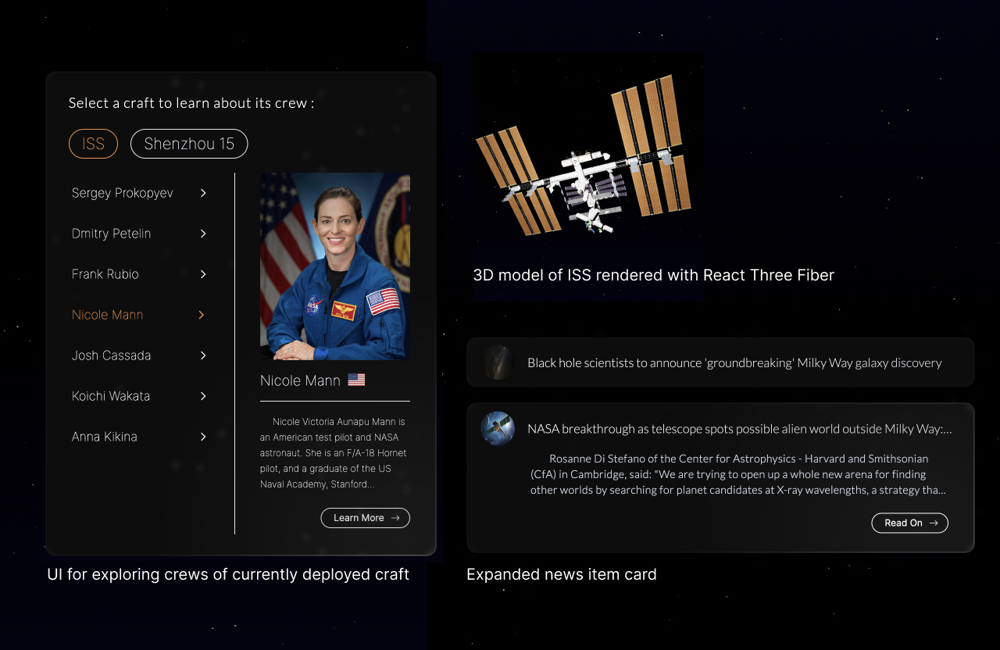

# Space News - News site

A Website that consumes three APIs and displays the data in a way that is fun and interesting for the user.

## Table of contents

- [Overview](#overview)
  - [About](#about)
  - [Screenshot](#screenshot)
  - [Links](#links)
- [My process](#my-process)
  - [Built with](#built-with)
  - [What I learned](#what-i-learned)
  - [Continued development](#continued-development)
  - [Useful resources](#useful-resources)
- [Author](#author)

## Overview

### About

- Features a news feed that displays popular articles from around the web fetched from Perigon News API. Only articles with content relating to space and space travel are fetched. Results are paginated with five articles displayed per page.

- The ’Who’s in Space' feature fetches a list of astronauts currently in space. I used JavaScript to take this data and reorganise it into an object for each manned craft currently in space. This allowed me to display the data in a way that I think provided the best user experience. 

- 3D models of the most commonly used craft are displayed when exploring that particular crew. And if a new craft enters space that isn’t one of these common ones, a generic model of a typical space craft is displayed instead. 

- The names of the astronauts are dynamically passed to a 3rd API that retrieves a profile for that astronaut and displays it to the user. If for any reason the astronaut is not listed on that database, a link is dynamically generated to a Wikipedia search of their name.

- Cursor location based animations are used to help create a sci-fi vibe, and particles.js is used to create a dynamic background of twinkling stars.

### Screenshot

### Links

- [Live site](https://spacenewsco.netlify.app/)

## My process

### Built with

- Next.js
- Tailwind
- Three.js (React Three Fiber)
- Rest APIs
- Blender3D
- Adobe Illustrator

### What I learned

This Project was an exercise in APIs. Fetching and managing data from 3 separate APIs was a challenge for me, and especially passing data returned from one API into another was a real learning curve. 

My abilities with tailwind also expanded here, and I can see why this is such a popular method of styling. I do however find that it made the code look quite chaotic. Even though tailwind is quick and very easy, I think I prefer the order and organization benefits offered by Sass.

Three.js is a challenging technology but one I take particular pleasure in exploring. 3D modelling has been a hobby of mine for years and Three.js and React Three Fiber offer me the opportunity to include my hobby in my portfolio projects. I am excited about the future of 3d in web development so was glad to be able to use this project to learn more about this technology.

### Continued development

This project has shown me that tailwind has downsides and inspired me to try other styling methods. I have been working with styled components since and would like to continue learning how to use them, as I find them much cleaner to work with.

I believe Perigon is removing its free developer tier so I think the site will lose its news feed page. When that happens i would like to compensate by expanding the “Who’s in space” section, providing deeper astronaut profiles and greater interactivity with the 3d models.

Currently, I think my method for regrouping the array of astronaut objects into an object for each crew is quite convoluted. In my research, I found a method using .reduce(). In future, I would like to take this approach and hopefully simplify the code some.

### Useful resources

- [Animation and 3D in react-three-fiber (with Paul Henschel) — Learn With Jason](https://www.youtube.com/watch?v=1rP3nNY2hTo&t=912s) - This video is an excellent introduction to React Three Fiber, which is a react renderer for Three.js. It covers all the basics I needed to render the 3D spacecraft models on my site.
- [mdn web docs](https://developer.mozilla.org/en-US/docs/Web/JavaScript/Reference/Global_Objects/Array/reduce) - The project had me revisiting a lot of the vanilla JavaScript I learned right at the beginning of my journey. Working with objects and arrays, using for loops, .push, .map(), and if statements. So of course trusty mdn web docs was on hand to remind me of the syntax.
- [Perigon news API](https://docs.goperigon.com/docs) - Perigon news Rest API was the most difficult of the 3 I worked with. The documentation really helped and gave me a broader understanding of APIs in general.

## Author

Jacob Dunbar
[jacobdunbar.com](https://www.jacobdunbar.com)
